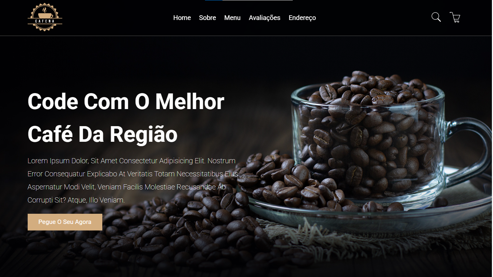

# DevClub Café ☕💻

Seja bem-vindo ao **DevClub Café**, uma cafeteria fictícia criada como projeto de treinamento em HTML e CSS.  
Aqui, café e código se encontram em um ambiente aconchegante com um toque dark mode 🌒.

## 🖥️ Sobre o Projeto

Este projeto foi desenvolvido com foco em:

- Estruturação de páginas com HTML5
- Estilização com CSS3 (tema escuro)
- Responsividade para dispositivos móveis
- Prática de organização de código e boas práticas

## 📄 Seções do Site

- **Home:** Apresentação do café com chamada principal
- **Sobre:** Um pouco da história do DevClub Café
- **Menu:** Cardápio com bebidas e lanches
- **Avaliações:** Comentários de clientes fictícios
- **Endereço:** Localização e contato

## 📸 Preview



## 💡 Tecnologias Utilizadas

- HTML5
- CSS3

## 📱 Responsivo?

Sim! O site foi desenvolvido com media queries para se adaptar a diferentes tamanhos de tela.

## 🚀 Como Visualizar

1. Clone o repositório:
```bash
git clone https://github.com/eduardaro/CafeteriaWeb.git

```

2. Abra o arquivo index.html em seu navegador.


## 📌 Observações

Este projeto foi feito com fins educacionais como parte de um treinamento em frontend.


